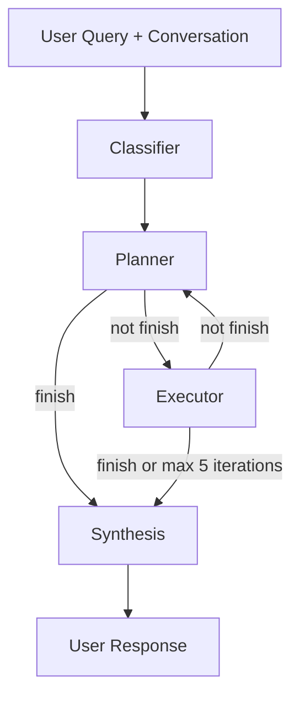

# Experiments

I tried three approaches before landing on the current one.

## Naive RAG (baseline)

Single-pass retrieval: embed the user query, retrieve top-5 chunks from Qdrant, synthesize. The same synthesis prompt is reused deliberately — this isolates the variable to retrieval quality rather than prompt quality. Implemented in `evals/examples/naive_rag_demo.py` and evaluated through `evals/examples/run_naive_rag_evals.py`.

## ReAct agent

**What:**   
Four nodes: classifier → planner → executor → synthesis. The classifier runs once upfront to extract a stable `core_question` from the raw message, giving the planner a fixed anchor across all iterations rather than re-reading the full conversation each time. The planner then decides which tools to call, the executor runs them in parallel, and the loop repeats until the planner marks done or hits the 5-iteration limit.

**Why:**   
Some queries can't be answered in a single retrieval pass — the next tool call depends on what the previous one returned. A structured workflow with fixed steps can't handle this. The ReAct loop lets the planner adapt mid-flight based on what it finds.

The planner has access to three tools and two sub-agent workflows:

| Type | Name | Purpose |
|---|---|---|
| Tool | `query_textbook` | Search the insurance textbook for concepts and definitions |
| Tool | `query_product_summary` | Search product summaries for benefits, exclusions, and premiums |
| Tool | `find_policy_details_with_policy_id` | Fetch full policy details by a known policy ID |
| Sub-agent | `name_match_workflow` | Resolve a product name the user mentioned to exact policy IDs |
| Sub-agent | `find_product_with_criteria_workflow` | Find products that match a set of criteria |

**Why not (for most queries):**   
Each iteration costs an LLM call to the planner. For a straightforward question about a single product, the structured workflow answers it in one pass at a fraction of the cost and latency. That's why the current setup routes everything through the structured workflow and keeps ReAct as future work for complex queries.

## Structured Reasoning-Driven workflow (current)

The structured workflow runs for every query. It's deterministic — the same steps fire in the same order every time — which makes it easier to trace, debug, and token-efficient compared to a ReAct loop that plans dynamically. The tradeoff is that it doesn't handle queries that genuinely require conditional tool chaining.

## Hybrid routing (future work)

The architecture supports a router LLM that classifies each query and dispatches to either the structured workflow or the ReAct agent. This is already implemented but currently bypassed in favour of the structured workflow while the core retrieval quality is being validated. The plan is to enable it once the eval baseline is established.
