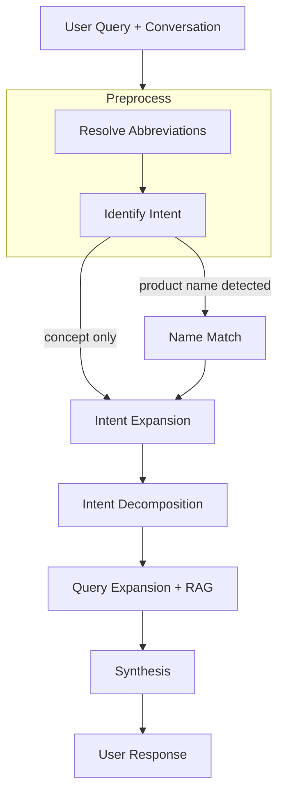

# askmeinsurance

AskMeInsurance is an AI chatbot for life insurance questions. It's built around a multi-step reasoning workflow with one testable claim: given the same synthesis prompt, structured agentic retrieval produces more helpful answers than single-pass naive RAG. That claim is tested by evals.


## Problem Statement

Insurance questions aren't straightforward lookups. When someone asks "tell me about product X", they want to know what it covers, what it excludes, how it compares to alternatives, and whether it makes sense for their situation. A naive RAG system retrieves chunks closest to the literal query and synthesizes from those. For specific factual questions that works. For open-ended questions it falls short, because the user's stated words only capture part of what they actually need.

My hypothesis: a multi-step workflow that reasons about intent and retrieves across multiple angles will score higher on helpfulness than single-pass retrieval, given the same synthesis prompt. I'm testing this by running the same eval suite against both approaches.


## Experiments

I tried three approaches before landing on the current one.

### Naive RAG (baseline)

Single-pass retrieval: embed the user query, retrieve top-5 chunks from Qdrant, synthesize. The same synthesis prompt is reused deliberately — this isolates the variable to retrieval quality rather than prompt quality. Implemented in `examples/naive_rag_demo.ipynb`.

### ReAct agent

A planner-executor loop (max 5 iterations). The planner LLM decides which tools to call next, executes them in parallel, then synthesizes once it marks done. Good for queries that require conditional tool chaining ("find a CI plan that covers X, then compare its exclusions to Y"). Too slow and expensive for straightforward single-product questions.

### Structured workflow + ReAct routing (current)

A router LLM classifies each query and dispatches to either the structured workflow or the ReAct agent. Factual lookups go to the workflow; multi-step or underspecified queries go to ReAct. The workflow handles the common case fast; ReAct handles the long tail.


## Solution

My solution is a reasoning-driven workflow.



### Resolve abbreviations

Users refer to insurance products by shorthand ("GPP", "SFRII") and use Singapore-specific terms like "CI" for critical illness or "SA" for sum assured. Without resolving these first, intent extraction and retrieval both fail on the abbreviated form.

### Identify intent

The raw user message is condensed into a single self-contained phrase that anchors every subsequent step. This step also flags whether the user named a specific product, which determines whether the workflow takes the name-match path or skips straight to intent expansion. Short follow-up messages like "what about exclusions?" inherit product context from earlier in the conversation.

### Name match (conditional)

When a product name is detected, this step resolves it to exact policy IDs in the product catalog before retrieval begins. Different payment variants of the same product (5Pay, 10Pay, Single Premium) are stored as separate entries, so matching them correctly matters.

### Intent expansion

The condensed intent captures what the user asked. This step generates 2-3 complementary angles that would make the final answer more complete. If a user asks about guaranteed cash back, the expansion adds non-guaranteed bonuses, break-even analysis, and how bonus declarations work. Each expanded query is tagged by source type (textbook concept or product fact) so retrieval goes to the right place.

### Intent decomposition

The enriched intent set is flattened into atomic retrieval targets. Each one is self-contained (no pronouns, no cross-references) and covers exactly one thing to look up. Treating each sub-intent as its own retrieval unit, rather than issuing one blended query, is what makes the retrieved context broad enough to support a complete answer.

### Query expansion + RAG

Each atomic intent is rephrased to match how the source documents were written. Textbook queries become conceptual ("How does X work?"); product queries become feature-specific ("AIA Smart Flexi Rewards II 5Pay guaranteed cash benefit payout schedule"). Retrieval then runs in parallel against two Qdrant collections: the insurance textbook and the product summary store.

### Synthesis

The final answer is generated from retrieved evidence, conversation history, and the original intent. The synthesis prompt asks for completeness (what the product does and does not do), multiple angles, and plain language with jargon defined on first use. The same prompt runs in the naive RAG baseline, so the only variable between the two approaches is what gets passed to it.


## Evals

Evaluation uses [DeepEval](https://github.com/confident-ai/deepeval) with Gemini Flash Lite as the judge. Test cases are managed in a Langfuse dataset (`insurance_chatbot_evals`) and results are linked back to the traces that produced them.

| Metric | What it measures |
|---|---|
| Helpfulness | Intent alignment, completeness, and tone |
| Tone & approach | Empathy, decisiveness, contextual fit |
| Honesty | Factual fidelity, calibrated uncertainty |
| Faithfulness | Consistency with expected output |
| Intent coverage | Custom two-phase metric: decomposes expected output into atomic coverage points, then binary-checks each in the actual output |
| Contextual precision / recall | Whether retrieved chunks are relevant and complete |

The same suite runs against the naive RAG baseline. The primary claim of this project lives or dies by the Helpfulness delta between the two.


## Observability and guardrails

### Observability

All LangGraph node executions are captured via Langfuse's `CallbackHandler` without manual instrumentation. Each user message produces one trace scoped to its conversation and user. Guardrail verdicts (guard name, safety level, score, latency, reason) are logged as named spans on the same trace. Eval runs post scores back to Langfuse dataset runs, so benchmark results are tied directly to the traces that produced them.

### Guardrails

Input and output guards run on every request via the `deepteam` library (`backend/app/core/guardrails.py`).

Input guards (before the graph runs):
- `PromptInjectionGuard`
- `InsuranceTopicalGuard` (custom) — resolves abbreviations before classifying, so "AIA" becomes "AIA Insurance" before the topicality check runs

Output guards (after the graph responds):
- `ToxicityGuard`, `PrivacyGuard`, `IllegalGuard`

An input breach rejects the request before the graph runs. An output breach replaces the answer with a fallback. Both are configurable via `GUARDRAILS_ENABLED` and `GUARDRAILS_SAMPLE_RATE`.


## Document ingestion

<to be added later>


## Setup

Copy `backend/sample.env` to `backend/.env` and `frontend/sample.env` to `frontend/.env`, then fill in your API keys.

### Docker compose

```
docker compose --env-file frontend/.env up --build -d
```
