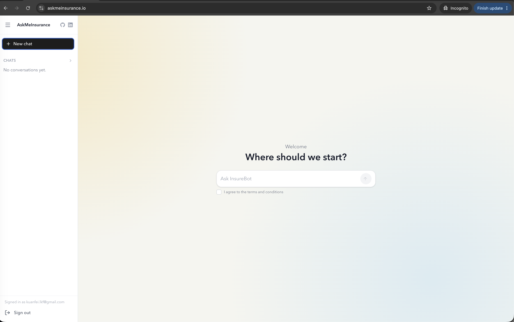
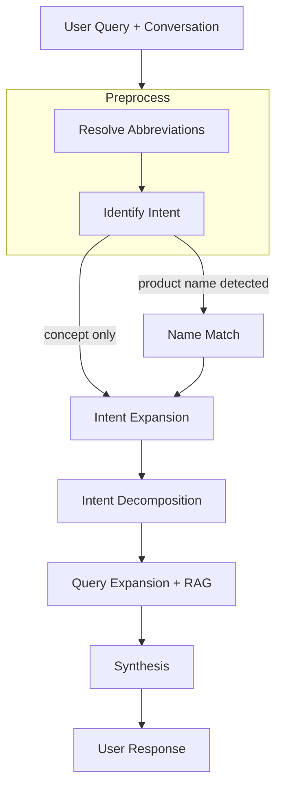
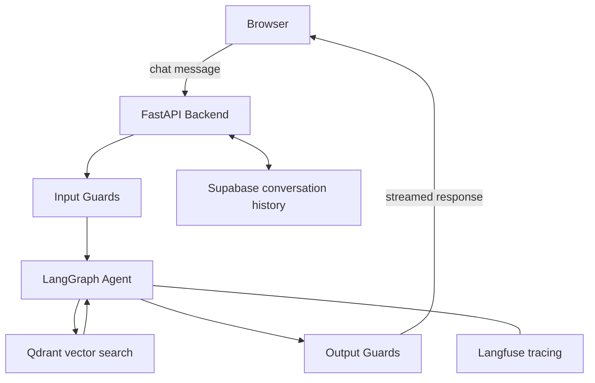

# askmeinsurance

AskMeInsurance is an AI chatbot for life insurance questions. It's built around a multi-step reasoning workflow with one testable claim: naive RAG fails to provide complete information on insurance questions — covering all policy details, exclusions, and conditions a user needs, not just what their literal words asked for. That claim is tested by evals. The demo can be accessed [here](https://askmeinsurance.io)



## Problem Statement

Insurance questions aren't straightforward lookups. When someone asks "tell me about product X", they want to know what it covers, what it excludes, how it compares to alternatives, and whether it makes sense for their situation. A [naive RAG](EXPERIMENTS.md#naive-rag-baseline) system retrieves chunks closest to the literal query and synthesizes from those. For specific factual questions that works. For open-ended questions it falls short, because the user's stated words only capture part of what they actually need.

In most domains, an incomplete answer is just less useful. In insurance, it actively misleads. If a user asks about life insurance benefits, but omits the corresponding exclusions, the user files a claim assuming they're covered — and gets denied. Incompleteness isn't a quality problem; it's a trust and compliance problem.

**My hypothesis:** naive RAG systematically fails to surface complete information on insurance questions, because it retrieves against the user's literal words rather than the full scope of what they need to know. A multi-step workflow that reasons about intent and retrieves across multiple angles will cover the original intent more completely.

The hypothesis holds. Across 30 test cases, intent coverage went from 0.41 to 0.76 (+0.35) and contextual recall from 0.49 to 0.95 (+0.46) — the structured workflow retrieves nearly everything needed to answer, while naive RAG frequently misses the relevant product documents entirely. Helpfulness also improved (+0.06), but that gap understates the real difference: the judge partially rewards well-worded refusals ("I don't have that information, please contact AIA") almost as highly as correct answers, so a small helpfulness delta can coexist with a large completeness gap. → [See full eval results](evals/README.md#results-30-test-cases)

## Reference links
- [Experiments](EXPERIMENTS.md)
- [Evals](evals/README.md)
- [Document ingestion](document_ingestion/ingestion_pipeline/README.md)


## Structured Reasoning-Driven workflow




<details>
<summary><strong>Resolve abbreviations</strong></summary>

>>**What:**  
Scans the user's latest message against a product registry and resolves any shorthand to its full form — "GPP" becomes "Guaranteed Protect Plus", "CI" becomes "critical illness".

>>>**Why:**  
Singapore insurance users routinely abbreviate product names and industry terms. Without this step, the intent extraction LLM sees an unfamiliar token and either misreads it or ignores it, which means the retrieval that follows targets the wrong thing.
</details>

<details>
<summary><strong>Identify intent</strong></summary>

>>**What:**  
Condenses the full conversation into a single self-contained 10-20 word phrase. Also flags whether the user named a specific product, which determines the routing path downstream.

>>>**Why:**  
Every subsequent step — expansion, decomposition, retrieval — operates on this phrase, not the raw message. A short follow-up like "what about exclusions?" is ambiguous on its own; anchoring it to a condensed intent that carries conversation context keeps the whole workflow coherent across turns.
</details>


<details>
<summary><strong>Name match (conditional)</strong></summary>

>>**What:**  
Resolves the product name the user mentioned to exact policy IDs in the product catalog. Only runs when a product name was detected in the previous step.

>>>**Why:**  
Different payment variants of the same product (5Pay, 10Pay, Single Premium) are stored as separate entries in the vector store. Without resolving to the right policy ID first, retrieval pulls chunks from the wrong variant and the answer is factually off.
</details>

<details>
<summary><strong>Intent expansion</strong></summary>

>>**What:**  
Takes the condensed intent and generates 2-3 complementary angles the user didn't explicitly ask for. Each expanded query is tagged by source type (textbook or product) so retrieval knows where to look.

>>>**Why:**  
The user's literal question is rarely the full picture of what they need. Someone asking about guaranteed cash back probably also needs to understand non-guaranteed bonuses and what the break-even point looks like. This step is where the answer starts becoming holistic rather than just technically correct.
</details>

<details>
<summary><strong>Intent decomposition</strong></summary>

>>**What:**  
Flattens the original intent and all expanded queries into a flat list of atomic retrieval targets. Each entry is self-contained — no pronouns, no cross-references, one thing to look up.

>>>**Why:**  
A blended query like "guaranteed cash back and how bonuses work and break-even" will retrieve chunks that partially match each part but fully match none. Breaking it into atomic units means each retrieval call has a precise target, and the combined context covers the full picture.
</details>

<details>
<summary><strong>Query expansion + RAG</strong></summary>

>>**What:**  
Rephrases each atomic intent to match the vocabulary of its target collection. Textbook queries become conceptual ("How does X work?"); product queries become feature-specific. Retrieval then runs in parallel against two Qdrant collections:

- `insurance_text_book` — a Singapore life insurance textbook covering 17 chapters of foundational concepts: risk, policy types, underwriting, claims, regulatory frameworks, and industry terminology
- `product_summary` — product summaries for 30 AIA life insurance products across endowment, term, and whole life categories, covering benefits, exclusions, premiums, riders, and surrender values

>>>**Why:**  
The two collections are written in fundamentally different styles. The textbook is written like an educational reference — definitional, conceptual, chapter-structured. The product summaries are written like policy documents — benefit tables, exclusion clauses, payout conditions. A user's intent phrase sits in neither style; it's conversational. Sending the same query to both collections would underperform in both. Rephrasing each intent into the vocabulary of its target collection closes the semantic gap between how users ask and how documents are written.
</details>

<details>
<summary><strong>Synthesis</strong></summary>

>>**What:**  
Generates the final answer from retrieved evidence, conversation history, and the original intent. Same synthesis prompt used in the naive RAG baseline.

>>>**Why:**  
Using the same prompt as naive RAG is intentional — it isolates the variable. If the agentic workflow scores higher on helpfulness, the difference comes from what gets passed to synthesis, not how synthesis is prompted.
</details>


## System Architecture



## Tech Stack

| Layer | Technology | Notes |
|---|---|---|
| Backend | FastAPI + LangGraph | API server and stateful agent orchestration |
| LLM | Gemini 2.5 Flash Lite via OpenRouter | Used across all workflow nodes |
| Vector DB | Qdrant | Two collections: insurance textbook and product summaries |
| Auth + DB | Supabase | RS256 JWT auth, conversation and message persistence |
| Observability | Langfuse | Distributed tracing across all LangGraph node executions |
| Guardrails | deepteam | Input and output safety guards |
| Evals | DeepEval  | LLM-as-judge evaluation framework |
| Frontend | React 19 + TypeScript + Vite | Chat UI with SSE streaming support |
| Styling | Tailwind CSS v4 | |


## Observability and guardrails

### Observability

All LangGraph node executions are captured via Langfuse's `CallbackHandler` without manual instrumentation. Each user message produces one trace scoped to its conversation and user. Guardrail verdicts (guard name, safety level, score, latency, reason) are logged as named spans on the same trace. Eval runs post scores back to Langfuse dataset runs, so benchmark results are tied directly to the traces that produced them.

### Guardrails

Input and output guards run on every request via the `deepteam` library (`backend/app/core/guardrails.py`).

Input guards (before the graph runs):
- `PromptInjectionGuard`
- `InsuranceTopicalGuard` (custom) — the built-in topical guard has no knowledge of Singapore insurance shorthand, so a query like "tell me about AIA" could be misclassified as off-topic. This guard does three things: resolves abbreviations first ("AIA" → "AIA Insurance"), checks whether the message is insurance-related, and passes through messages whose intent is conversational (greetings, clarifications) even if they contain no insurance keywords

Output guards (after the graph responds):
- `ToxicityGuard`, `PrivacyGuard`, `IllegalGuard`

An input breach rejects the request before the graph runs. An output breach replaces the answer with a fallback. Both are configurable via `GUARDRAILS_ENABLED` and `GUARDRAILS_SAMPLE_RATE`.


## Local Setup
### Docker compose

```
cp backend/example.env backend/.env
# fill backend/.env with the required backend secrets

docker compose --env-file frontend/.env up --build -d
```


