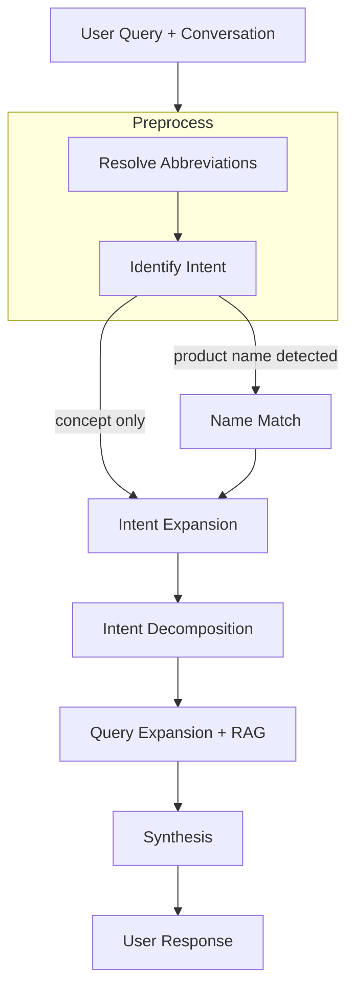

# askmeinsurance

AskMeInsurance is an AI chatbot for life insurance questions. It's built around a multi-step reasoning workflow with one testable claim: given the same synthesis prompt, structured agentic retrieval produces more helpful answers than single-pass naive RAG. That claim is tested by evals.


## Problem Statement

Insurance questions aren't straightforward lookups. When someone asks "tell me about product X", they want to know what it covers, what it excludes, how it compares to alternatives, and whether it makes sense for their situation. A naive RAG system retrieves chunks closest to the literal query and synthesizes from those. For specific factual questions that works. For open-ended questions it falls short, because the user's stated words only capture part of what they actually need.

My hypothesis: a multi-step workflow that reasons about intent and retrieves across multiple angles will score higher on helpfulness than single-pass retrieval, given the same synthesis prompt. I'm testing this by running the same eval suite against both approaches.


## Experiments

I tried three approaches before landing on the current one.

### Naive RAG (baseline)

Single-pass retrieval: embed the user query, retrieve top-5 chunks from Qdrant, synthesize. The same synthesis prompt is reused deliberately — this isolates the variable to retrieval quality rather than prompt quality. Implemented in `examples/naive_rag_demo.ipynb`.

### ReAct agent

A planner-executor loop (max 5 iterations). The planner LLM decides which tools to call next, executes them in parallel, then synthesizes once it marks done. Good for queries that require conditional tool chaining ("find a CI plan that covers X, then compare its exclusions to Y"). Too slow and expensive for straightforward single-product questions.

### Structured workflow + ReAct routing (current)

A router LLM classifies each query and dispatches to either the structured workflow or the ReAct agent. Factual lookups go to the workflow; multi-step or underspecified queries go to ReAct. The workflow handles the common case fast; ReAct handles the long tail.


## Solution

My solution is a reasoning-driven workflow.



### Resolve abbreviations

**What:** Scans the user's latest message against a product registry and resolves any shorthand to its full form — "GPP" becomes "Guaranteed Protect Plus", "CI" becomes "critical illness".

**Why:** Singapore insurance users routinely abbreviate product names and industry terms. Without this step, the intent extraction LLM sees an unfamiliar token and either misreads it or ignores it, which means the retrieval that follows targets the wrong thing.

### Identify intent

**What:** Condenses the full conversation into a single self-contained 10-20 word phrase. Also flags whether the user named a specific product, which determines the routing path downstream.

**Why:** Every subsequent step — expansion, decomposition, retrieval — operates on this phrase, not the raw message. A short follow-up like "what about exclusions?" is ambiguous on its own; anchoring it to a condensed intent that carries conversation context keeps the whole workflow coherent across turns.

### Name match (conditional)

**What:** Resolves the product name the user mentioned to exact policy IDs in the product catalog. Only runs when a product name was detected in the previous step.

**Why:** Different payment variants of the same product (5Pay, 10Pay, Single Premium) are stored as separate entries in the vector store. Without resolving to the right policy ID first, retrieval pulls chunks from the wrong variant and the answer is factually off.

### Intent expansion

**What:** Takes the condensed intent and generates 2-3 complementary angles the user didn't explicitly ask for. Each expanded query is tagged by source type (textbook or product) so retrieval knows where to look.

**Why:** The user's literal question is rarely the full picture of what they need. Someone asking about guaranteed cash back probably also needs to understand non-guaranteed bonuses and what the break-even point looks like. This step is where the answer starts becoming holistic rather than just technically correct.

### Intent decomposition

**What:** Flattens the original intent and all expanded queries into a flat list of atomic retrieval targets. Each entry is self-contained — no pronouns, no cross-references, one thing to look up.

**Why:** A blended query like "guaranteed cash back and how bonuses work and break-even" will retrieve chunks that partially match each part but fully match none. Breaking it into atomic units means each retrieval call has a precise target, and the combined context covers the full picture.

### Query expansion + RAG

**What:** Rephrases each atomic intent to match the vocabulary of its target collection. Textbook queries become conceptual ("How does X work?"); product queries become feature-specific. Retrieval then runs in parallel against two Qdrant collections: the insurance textbook and the product summary store.

**Why:** Semantic search works best when the query sounds like the documents it's searching. A business-language intent phrase and a product brochure phrase are semantically distant even when they mean the same thing. Rephrasing closes that gap.

### Synthesis

**What:** Generates the final answer from retrieved evidence, conversation history, and the original intent. Same synthesis prompt used in the naive RAG baseline.

**Why:** Using the same prompt as naive RAG is intentional — it isolates the variable. If the agentic workflow scores higher on helpfulness, the difference comes from what gets passed to synthesis, not how synthesis is prompted.


## Evals

Evaluation uses [DeepEval](https://github.com/confident-ai/deepeval) with Gemini Flash Lite as the judge. Test cases are managed in a Langfuse dataset (`insurance_chatbot_evals`) and results are linked back to the traces that produced them.

| Metric | What it measures |
|---|---|
| Helpfulness | Intent alignment, completeness, and tone |
| Tone & approach | Empathy, decisiveness, contextual fit |
| Honesty | Factual fidelity, calibrated uncertainty |
| Faithfulness | Consistency with expected output |
| Intent coverage | Custom two-phase metric: decomposes expected output into atomic coverage points, then binary-checks each in the actual output |
| Contextual precision / recall | Whether retrieved chunks are relevant and complete |

The same suite runs against the naive RAG baseline. The primary claim of this project lives or dies by the Helpfulness delta between the two.

### Why not AnswerRelevancyMetric

DeepEval's `AnswerRelevancyMetric` scores answers using this ratio:

```
relevant statements / total statements
```

It decomposes the actual output into atomic statements, then checks each one against the original input query. If the statement addresses the query, it's relevant. If not, it drags the score down.

That formula actively punishes the behaviour this workflow is designed to produce. If the base answer covers A+B+C and the workflow adds D+E (non-guaranteed bonuses, break-even analysis), D and E get classified as irrelevant to the original query and lower the score. A minimal answer that only covers A+B+C would score higher than a richer one that covers everything plus more.

The custom `IntentCoverageMetric` flips the direction. Instead of starting from the actual output and asking "is this relevant?", it starts from the expected output (a base answer written for the exact intent) and asks "is this covered?". It decomposes the base answer into atomic coverage points, then binary-checks each one in the actual output. Score = covered points / total points. Extra content in the actual output is ignored — it neither helps nor hurts. What matters is whether the original intent was fully addressed.


## Observability and guardrails

### Observability

All LangGraph node executions are captured via Langfuse's `CallbackHandler` without manual instrumentation. Each user message produces one trace scoped to its conversation and user. Guardrail verdicts (guard name, safety level, score, latency, reason) are logged as named spans on the same trace. Eval runs post scores back to Langfuse dataset runs, so benchmark results are tied directly to the traces that produced them.

### Guardrails

Input and output guards run on every request via the `deepteam` library (`backend/app/core/guardrails.py`).

Input guards (before the graph runs):
- `PromptInjectionGuard`
- `InsuranceTopicalGuard` (custom) — resolves abbreviations before classifying, so "AIA" becomes "AIA Insurance" before the topicality check runs

Output guards (after the graph responds):
- `ToxicityGuard`, `PrivacyGuard`, `IllegalGuard`

An input breach rejects the request before the graph runs. An output breach replaces the answer with a fallback. Both are configurable via `GUARDRAILS_ENABLED` and `GUARDRAILS_SAMPLE_RATE`.


## Document ingestion

<to be added later>


## Setup

Copy `backend/sample.env` to `backend/.env` and `frontend/sample.env` to `frontend/.env`, then fill in your API keys.

### Docker compose

```
docker compose --env-file frontend/.env up --build -d
```
