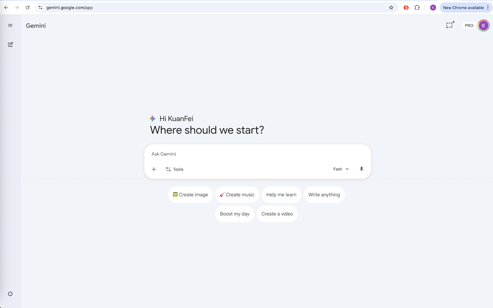
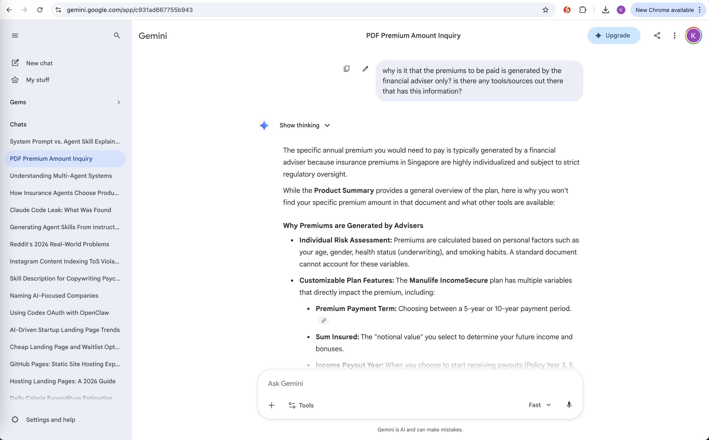
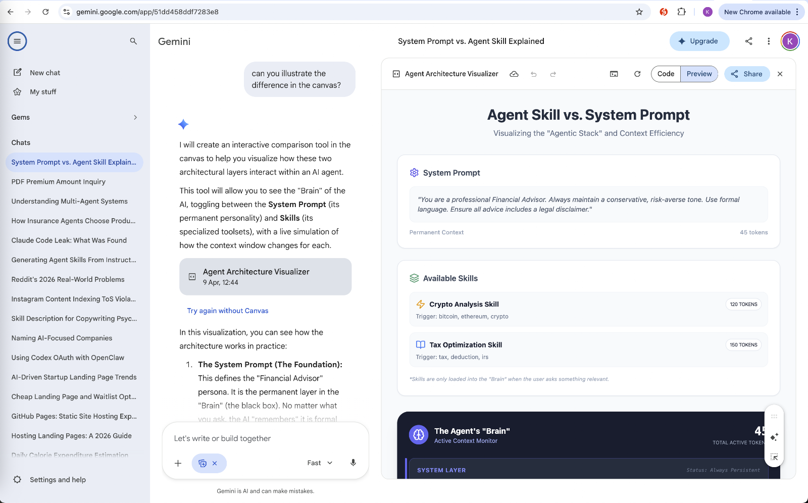
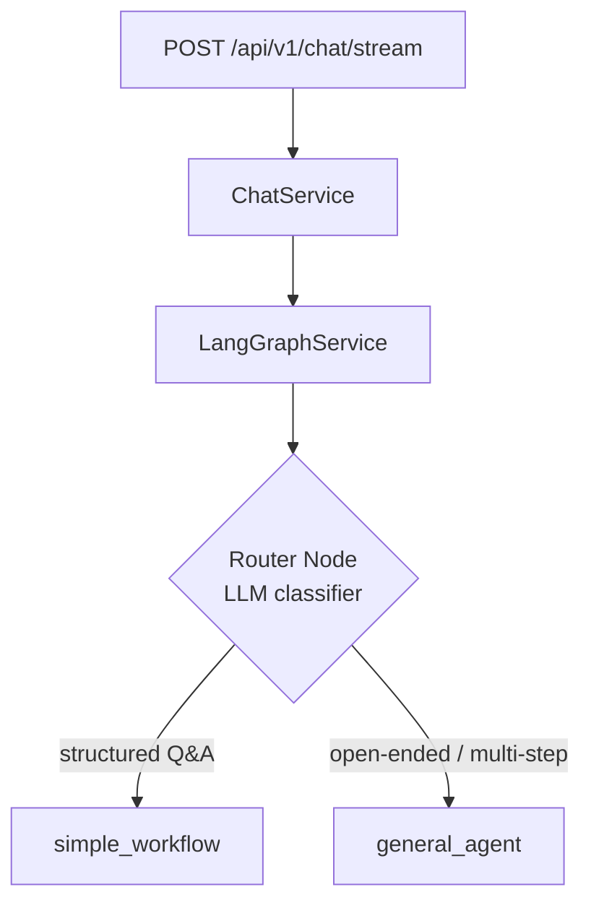
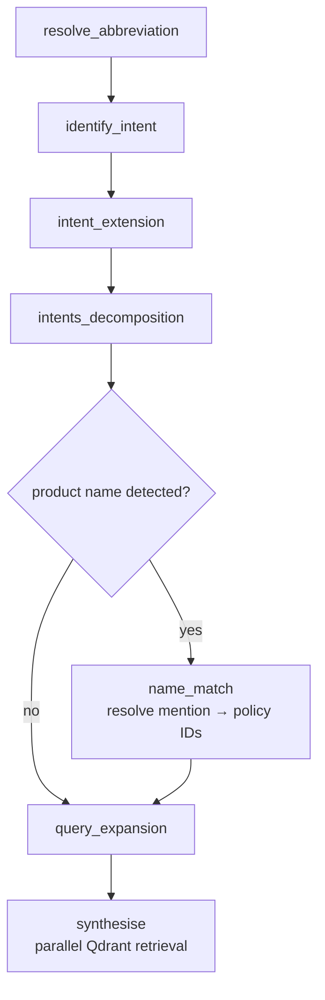
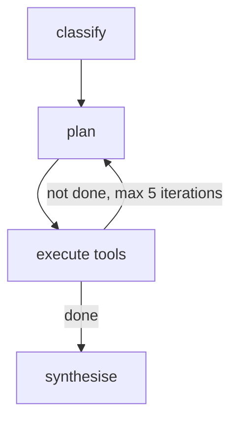

# askmeinsurance

An AI-powered insurance Q&A assistant that routes queries through a multi-agent pipeline to deliver accurate, product-specific answers. Ask about any insurance product or general insurance concept — the system selects the right retrieval strategy and synthesises an answer grounded in both a product registry and an insurance textbook corpus.

## Screenshots

| Start | Chat | Chat + Canvas |
|---|---|---|
|  |  |  |

## Architecture

Incoming chat messages are streamed through a LangGraph state machine. A router node classifies each query and dispatches to one of two subgraphs.

**Request flow**



**simple_workflow** — used for direct insurance questions



**general_agent** — used for open-ended or multi-step questions



## Tech Stack

| Layer | Technology | Purpose |
|---|---|---|
| Backend | FastAPI + LangGraph | API server + stateful agent orchestration |
| LLM | Gemini 2.5 Flash Lite via OpenRouter | Primary reasoning model across all agents |
| Vector DB | Qdrant | Semantic search over insurance textbook + product summaries |
| Observability | Langfuse | Distributed tracing across all LangGraph node executions |
| Auth + DB | Supabase | RS256 JWT auth + conversation/message persistence |
| Frontend | React 19 + TypeScript + Vite | Chat UI with streaming SSE support |
| Styling | Tailwind CSS v4 | |
| Canvas | Excalidraw | In-chat architecture diagram visualizations |

## Key Design Decisions

**Config-driven model selection.** `app/agent/config.yaml` maps every agent to its model, timeout, temperature, and structured-output mode. No model names or timeouts appear in Python — swapping a model means editing one YAML line.

**Structured output with JSON fallback.** `ainvoke_structured_with_fallback()` in `llm_service.py` first attempts native structured output. When the provider (e.g. OpenRouter) returns plain text instead of a function-call schema, it strips markdown fences, bracket-parses the first JSON object, and validates through Pydantic. This handles the inconsistent structured-output support across OpenRouter-proxied models without duplicating prompts.

**Conditional workflow routing.** After intent decomposition, the graph checks whether any sub-intent targets a product (`source_type in ("product", "both")`). If yes, it routes through `name_match` to resolve the user's mention to actual policy IDs before retrieval. If not, it skips directly to `query_expansion`, avoiding an unnecessary LLM call on concept-only questions.

## Local Setup

**Prerequisites:** Python 3.11+, `uv`, Node 22+

```bash
# Backend
cp backend/example.env backend/.env  # fill in OPENROUTER_API_KEY, QDRANT_URL, SUPABASE_* keys
cd backend
uv run uvicorn app.main:app --reload  # http://localhost:8000

# Frontend (separate terminal)
cp frontend/sample.env frontend/.env
cd frontend
npm install
npm run dev                           # http://localhost:5173
```

Set `AUTH_ENABLED=false` in `backend/.env` for local dev without Supabase auth.

## Docker

The app can also run locally in a production-like Docker setup: FastAPI is served by Uvicorn and the built Vite frontend is served by Nginx.

```bash
cp backend/example.env backend/.env
# fill backend/.env with the required backend secrets

docker compose up --build
```

Open the frontend at `http://localhost:5173`. The backend is exposed at `http://localhost:8000`, with a public health check at `http://localhost:8000/health`.

For local Docker builds, frontend browser-safe values are passed as build args. By default, Compose sets `VITE_BACKEND_BASE_URL=http://localhost:8000`. If Supabase auth is needed locally, export these before building:

```bash
export VITE_SUPABASE_URL="..."
export VITE_SUPABASE_ANON_KEY="..."
docker compose up --build
```

## Railway Deployment

Deploy this repo as two Railway services from the same GitHub repository.

**Backend service**

- Root directory: `backend`
- Builder: Dockerfile
- Public networking: enabled
- Start command: use the Dockerfile default command
- Health check path: `/health`

Set backend runtime variables in Railway:

```env
APP_ENV=prod
APP_DEBUG=false
AUTH_ENABLED=true
CORS_ALLOWED_ORIGINS=https://<frontend-railway-domain>
SUPABASE_URL=...
SUPABASE_ANON_KEY=...
SUPABASE_SERVICE_ROLE_KEY=...
SUPABASE_JWT_SECRET=...
OPENAI_API_KEY=...
GEMINI_API_KEY=...
OPENROUTER_API_KEY=...
QDRANT_URL=...
QDRANT_API_KEY=...
LANGFUSE_PUBLIC_KEY=...
LANGFUSE_SECRET_KEY=...
LANGFUSE_HOST=...
```

Railway injects `PORT` automatically; the backend Dockerfile binds to `${PORT:-8000}`.

**Frontend service**

- Root directory: `frontend`
- Builder: Dockerfile
- Public networking: enabled

Set frontend build-time variables in Railway:

```env
VITE_BACKEND_BASE_URL=https://<backend-railway-domain>
VITE_SUPABASE_URL=...
VITE_SUPABASE_ANON_KEY=...
```

Only `VITE_*` values are embedded into the browser bundle. Keep backend secrets, service-role keys, JWT secrets, LLM keys, Qdrant keys, and Langfuse secret keys on the backend service only.

## Evals

Offline evaluation scripts under `evals/` import backend code directly (no running server needed). See [`evals/README.md`](evals/README.md) for setup.

```bash
cd evals
uv run python run_evals.py --limit 5
```
